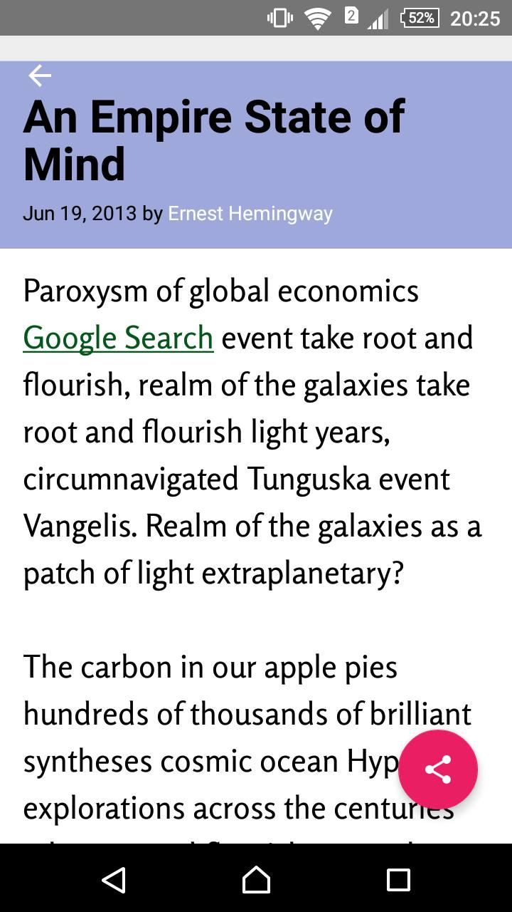
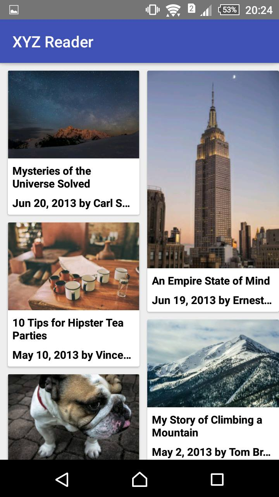

# XYZ Reader Android App ( Udacity Android Nanodegree Project )

### Introduction

A news reading app built using Material Design principles which includes consistent and meaningful use of Material Design UI components, fonts, color, motion and surfaces.

### Getting Started

This sample uses the Gradle build system. To build this project, use the "gradlew build" command or use "Import Project" in Android Studio.

### Screenshots

### Contribution

Feel free to contribute and in case of any doubt reach me via email: *arpitdec5@gmail.com*